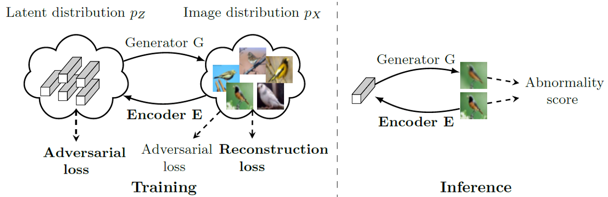
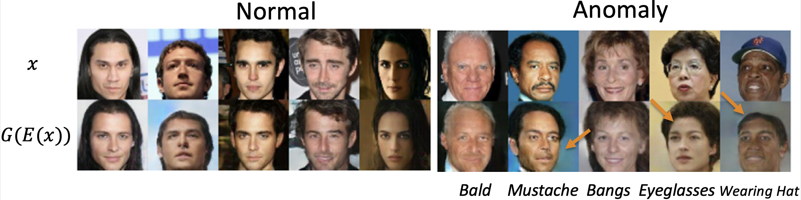

# Perceptual Image Anomaly Detection — Pytorch Implementation

[![License][license-shield]][license-url]

**Perceptual Image Anomaly Detection**<br>
Nina Tuluptceva, Bart Bakker, Irina Fedulova, Anton Konushin<br>
2019<br>

The final authenticated publication is available online at [https://link.springer.com/chapter/10.1007/978-3-030-41404-7_1](https://link.springer.com/chapter/10.1007/978-3-030-41404-7_12).

Arxiv: [https://arxiv.org/abs/1909.05904](https://arxiv.org/abs/1909.05904) <br>

Abstract: <br>
We present a novel method for image anomaly detection, where algorithms that use samples drawn from some distribution of “normal” data, 
aim to detect out-of-distribution (abnormal) samples.
 Our approach includes a combination of encoder and generator for mapping an image distribution to a predefined latent distribution and vice versa. 
 It leverages Generative Adversarial Networks to learn these data distributions and uses perceptual loss for the detection of image abnormality. 
 To accomplish this goal, we introduce a new similarity metric, which expresses the perceived similarity between images and is robust to changes in image contrast. 
 Secondly, we introduce a novel approach for the selection of weights of a multi-objective loss function (image reconstruction and distribution mapping) in the absence 
 of a validation dataset for hyperparameter tuning. After training, our model measures the abnormality of the input image as the perceptual dissimilarity between it and 
 the closest generated image of the modeled data distribution. The proposed approach is extensively evaluated on several publicly available image benchmarks and achieves 
 state-of-the-art performance.

The scheme of approach: 



Examples of reconstructions ([CelebA dataset](http://mmlab.ie.cuhk.edu.hk/projects/CelebA.html)): 


This is the official implementation of "Perceptual Image Anomaly Detection (PIAD)". 
It includes all experiments reported in the paper.

## Installation

`Python3.8` was used in the project ([Miniconda3-py38_4.8.3](https://docs.conda.io/en/latest/miniconda.html))
```bash 
wget https://repo.anaconda.com/miniconda/Miniconda3-py38_4.8.3-Linux-x86_64.sh
bash Miniconda3-py38_4.8.3-Linux-x86_64.sh -b -p ~/miniconda3_py38_4.8.3
export PATH="/home/$USER/miniconda3_py38_4.8.3/bin/:$PATH"
```

Installation:
```bash 
pip install -r requirements.txt
pip install -e .
```

## Get started 

To get started with MNIST, Fashion MNIST, and CIFAR10, data downloading is NOT required
(we used torchvision.datasets implementation of these datasets).

See `../config/cifar10.yaml` as an config example. Use `piad/train.py` and `piad/evaluate.py` to train and evaluate the model.

Examples:
```bash 
python piad/train.py ../config/cifar10.yaml --normal_class 0 --run 0
python piad/evaluate.py ../config/cifar10.yaml --normal_class 0 --run 0

python piad/train.py ../config/mnist.yaml --normal_class 0 --run 0
python piad/evaluate.py ../config/mnist.yaml --normal_class 0 --run 0

python piad/train.py ../config/fashion_mnist.yaml --normal_class 0 --run 0
python piad/evaluate.py ../config/fashion_mnist.yaml --normal_class 0 --run 0
```

## Run all experiments of the paper

```bash 
python run_all.py
```

## Data Preprocessing

### [COIL100](https://www.kaggle.com/jessicali9530/coil100)

1. Download data (`archive.zip`) from kaggle: [https://www.kaggle.com/jessicali9530/coil100](https://www.kaggle.com/jessicali9530/coil100)
2. Unzip `unzip archive.zip`

After these operations, you should obtain the following structure:

    ./data/
        coil-100/  # this is a root of dataset (you should this path as a dataset root in configs)
            coil-100/
                obj87__355.png
                ...

### [CelebA](http://mmlab.ie.cuhk.edu.hk/projects/CelebA.html)

0. `mkdir ./data/celeba/celeba/`
1. Download [official data](http://mmlab.ie.cuhk.edu.hk/projects/CelebA.html), 
for example, from [Google Drive](https://drive.google.com/drive/folders/0B7EVK8r0v71pWEZsZE9oNnFzTm8):
 download all files from the `Anno` and `Eval` folders and `img_align_celeba.zip` from the `Img` folder. 
2. `unzip img_align_celeba.zip`

After these operations, you should obtain the following structure:


    ./data/
        celeba/  # this is a root of dataset (you should this path as a dataset root in configs)
            celeba/      
                list_attr_celeba.txt  
                list_eval_partition.txt          
                list_landmarks_celeba.txt
                identity_CelebA.txt   
                list_bbox_celeba.txt  
                list_landmarks_align_celeba.txt
                img_align_celeba/
                    000001.jpg
                    000002.jpg
                    ...
     
You can test the dataset as follows:
```python
import torchvision

dataset = torchvision.datasets.CelebA(root='./data/celeba')
```

### [LSUN](https://www.yf.io/p/lsun)

Use the [official code](https://github.com/fyu/lsun) to download `bedroom` and `conference_room` classes. 

```bash
cd ../
git clone https://github.com/fyu/lsun.git
cd lsun
pip install lmdb
mkdir ./data/lsun
python download.py -c bedroom -o ../piad/data/lsun
python download.py -c conference_room -o ../piad/data/lsun
cd ../piad/data/lsun
unzip '*.zip'
```

After these operations, you should obtain the following structure:

    ./data/
        lsun/  # this is a root of dataset (you should this path as a dataset root in configs)
            conference_room_train_lmdb/
            conference_room_val_lmdb/
            bedroom_train_lmdb/
            bedroom_val_lmdb/    

<!-- MARKDOWN LINKS & IMAGES -->
<!-- https://www.markdownguide.org/basic-syntax/#reference-style-links -->
[license-shield]: https://img.shields.io/badge/License-Apache%202.0-blue.svg
[license-url]: https://github.com/ninatu/mood_challenge/blob/master/LICENSE

## Cite

If you use this code in your research, please cite

```bibtex
@InProceedings{10.1007/978-3-030-41404-7_12,
author="Tuluptceva, Nina and Bakker, Bart and Fedulova, Irina and Konushin, Anton",
title="Perceptual Image Anomaly Detection",
booktitle="Pattern Recognition",
year="2020",
publisher="Springer International Publishing",
address="Cham",
pages="164--178",
}
```
